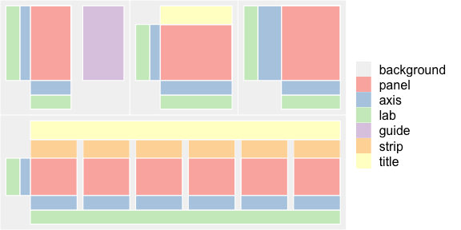

Figures for journals tend to have a couple of common features:

* Submitted as 300 or 600 dpi TIF or JPG files
* Individual panels labeled (a, b, c or A, B, C)
* Fit journal-specific size requirements (usually given in mm, corresponding to columns in the paper journal)
* Have legible text sizes (nothing below 4pt in the final image)

Many of us do some of these things within the script that makes the individual panels and then finish assembling the final product in another tool like PowerPoint, Illustrator, or the open source [Inkscape](https://inkscape.org/). My goal here is to demonstrate some tricks for academic figure making that make iterating on figure design easier. 

## Basics

### Data graphics in context

Where do you present your data? How do your plots differ between the first time they show up in lab meeting and your final manuscript? How many versions happened in between? Why did you make changes?

This tutorial/post is geared toward data graphics appearing in academic journals, which can look very different from the versions you'd show in a lab meeting or conference presentation. 

*If it fits your workflow, I recommend separating the code that generates and prepares your data from the code that makes your manuscript plots. Import your prepared data at the top of your plotting script instead. This saves headache in searching for your plotting code, and encourages separate scripts for making poster or presentation graphics from manuscript figures. They're just too different. :)*


### A quick word about R graphics

R has "base" graphics, which are totally fine. They get the job done, and can make exploratory data analysis super quick (e.g. `hist(data$x)`). If you're so inclined, you *can* get fancy with them and make plots worthy a journal.

[ggplot2](https://ggplot2.tidyverse.org/reference/index.html) provides an *enormous* library of plot types and customization options, all based on the *grammar of graphics*. Imagine an old school classroom projector with transparency sheets. You can consider ggplot's "geoms" like individual transparency sheets that you can stack to make a final plot. Stack a fit line on top of a scatter plot with `geom_scatter() + geom_abline()`. Today we'll focus on ggplot and it's friends.

### Building a graph with ggplot

We'll start with the classic [iris dataset](https://en.wikipedia.org/wiki/Iris_flower_data_set). 
```{r load_libraries, message=FALSE, warning=FALSE, results='asis' }
library(tidyverse) # includes the ggplot2 package
library(skimr)
skim(iris) %>% kable()
```


This is a basic scatterplot using the ggplot2 defaults. 
```{r default_scatter, fig.height=3, fig.width=5, fig.align = "center"}
scatter_plot <- iris %>%
  ggplot(aes(x = Petal.Width, y = Petal.Length, color = Species)) +
  geom_point()
scatter_plot
```

This looks alright, but we can do better! What would you change before including this in your manuscript?

### Basic tweaks to make "publication ready" plots

The `cowplot` package enhances your ggplot-based life with more "academically oriented" default settings. In my view, this is a lot faster going the DIY route (although you totally can!). Let's try that 1st plot again.

```{r better_scatter, fig.align="center", fig.height=3, fig.width=5, message=FALSE, warning=FALSE}
library(cowplot)
better_scatter <- iris %>%
  ggplot(aes(x = Petal.Width, y = Petal.Length, color = Species)) +
  geom_point()+
  theme_cowplot(12) # The number sets the text size
better_scatter
```

Does this look better? cowplot has several other functions that allow for customization of your figure, like adding a background grid. Standard ggplot syntax still works for making other changes. Note that you can make additional changes to an existing ggplot by adding them with the + and assigning to the same name.

```{r better_scatter2, fig.height=3, fig.width=5, fig.align = "center"}
better_scatter <- better_scatter +
  labs(y = "Petal length (cm)", x = "Petal width (cm)") +
  scale_color_brewer(
    type = "qual",
    palette = "Dark2", # from ColorBrewer
    labels = c("I. setosa", "I. versicolor", "I. virginica")
  ) +
  theme(legend.text = element_text(face = "italic"))
better_scatter
```

Let's try making a few other plots, so we can play around with combining them into a multi-panel figure. 

```{r box_plot, fig.height=3.5, fig.width=3, fig.align = "center"}
box_plot <- iris %>%
  ggplot(aes(x = Species, y = Sepal.Length)) +
  geom_boxplot(outlier.shape = NA) + # otherwise outliers will show as black dots
  theme_cowplot(12) +
  theme(axis.text.x = element_text(angle = 45, vjust = 0.5)) + # Useful for narrow plots
  labs(y = "Sepal Length (cm)")
box_plot
```

Ok, that looks fine, better than a barplot. But! For the same amount of space - we can show more *data* by overlaying the actual observations on top of the boxplots. Let's also keep the color scheme going from the first plot.

```{r better_box, fig.height=3.5, fig.width=3, fig.align = "center"}
better_box <- box_plot +
  geom_jitter(width = 0.2, aes(color = Species), alpha = 0.7) + # alpha makes points semi-transparent
  scale_x_discrete(labels = c("I. setosa", "I. versicolor", "I. virginica")) +
  scale_color_brewer(
    type = "qual",
    palette = "Dark2"    # Colors match the scatterplot because Species is a factor
  ) + 
  theme(axis.text.x = element_text(face = "italic")) +
  guides(color = FALSE)  # Hiding the legend because the x-axis gives the info
better_box
```

Using the `ggpubr` package, we can also add comparisons across groups. You can plot either the actual p-value, or use the *** notation: 

>we use the following convention for symbols indicating statistical significance: ns: p > 0.05, &ast;: p <= 0.05, &ast;&ast;: p <= 0.01,  &ast;&ast;&ast;: p <= 0.001, &ast;&ast;&ast;&ast;: p <= 0.0001 ([`ggpubr` docs](https://rpkgs.datanovia.com/ggpubr/))  

```{r fig.height=3.5, fig.width=3, message=FALSE, warning=FALSE, fig.align = "center"}
library(ggpubr)
anova_comparisons <- list(
  c("setosa", "versicolor"),
  c("versicolor", "virginica"),
  c("setosa", "virginica")
)
better_box <- better_box +
  # stat_compare_means(label.y = 10) + #adds the global ANOVA p-value, at y = 10
  stat_compare_means(comparisons = anova_comparisons, label = "p.signif") + # adds the pair-wise comparisons
  scale_y_continuous(expand = expand_scale(mult = c(0, .1))) # adds a little padding to the y-axis
better_box
```

### Saving a graph

The ggsave function let's you save the last generated plot (or whatever named one you specify) as vector graphics like SVG or PDF (good for importing into Illustrator or Inkscape), or raster graphics like TIF, JPG, or PNG. You can specify the dpi (raster only) and size of the image.

```{r saving}
ggsave(scatter_plot, filename = "figs/initial_scatterplot.svg", width = 6, height = 6, units = "in")
ggsave(scatter_plot, filename = "figs/initial_scatterplot.jpg", width = 6, height = 6, units = "in", dpi = 300)
```


_Quick tip: if you play around with the size of the Plots window in RStudio, you can find the size that you like and then click "Save as image" to find out the size of the plot. Use those dimensions in your ggsave call, and you'll have an easier time recreating the plot if you later decide to change something._

## Not quite basics

### Adding subpanel labels (a, b, c)

The quick way to label your graphs is with ggplot's `labs(title = "A")`. But! This aligns "A" with the top of the y-axis. That's ok, but maybe you want to align the title with the leftmost edge of the y-axis labels. Here's how to do that using `gridExtra` (credit: [Stack Overflow](https://stackoverflow.com/questions/25401111/left-adjust-title-in-ggplot2-or-absolute-position-for-ggtitle)). 

```{r echo=TRUE, fig.height=3, fig.width=5, message=FALSE, warning=FALSE, fig.align = "center"}
library(grid)
library(gridExtra)
p <- iris %>%
  ggplot(aes(x = Petal.Width, y = Petal.Length, color = Species)) +
  geom_point() +
  scale_color_brewer(
    type = "qual",
    palette = "Dark2",
    labels = c("I. setosa", "I. versicolor", "I. virginica")
  ) +
  theme_cowplot(12) +
  theme(legend.text = element_text(face = "italic"))

title.grob <- textGrob(
  label = "Panel A",
  x = unit(0, "lines"),
  y = unit(0, "lines"),
  hjust = 0, vjust = 0,
  gp = gpar(fontsize = 16)
)

p1 <- arrangeGrob(p, top = title.grob)   # layer the title grob on top of the subpanel grob
grid.arrange(p1)                         # prints the layered plot to the display
```

*Quick tip: if you need to put superscripts, subscripts, or Greek letters in your axis labels, check out [this blog post](https://trinkerrstuff.wordpress.com/2018/03/15/2246/) from Tyler Rinker for several examples.*


### Arranging multiple panels

Once you have your sub-panels generated and labeled, you can arrange them into a figure using several packages. There are lots of options here:

1. `arrangeGrob()` from gridExtra
2. `plot.grid()` from cowplot (will do the labeling for you!)
3. The [`patchwork` package](https://github.com/thomasp85/patchwork) from Thomas Lin Pedersen
4. `ggarange` from [egg](https://cran.r-project.org/web/packages/egg/vignettes/Overview.html)

I recommend choosing the easiest option that still lets you achieve your plotting dreams. patchwork is very easy to use, but not as fully featured as egg or gridExtra. gridExtra can be a little tricky to use, and is not quite as flexible as egg. cowplot is fairly simple and has defaults that are designed for academic figure making.

Here's the default behavior of gridExtra - which might send you running to StackOverflow...

```{r fig.height=3.5, fig.width=7, fig.align = "center"}
grid.arrange(better_scatter, better_box, ncol = 2)          # again, this prints to display
better_scatter_box <- arrangeGrob(p1, better_box, ncol = 2) # make a grob that includes both plots, so you can save it
```

Cringing a little at the alignment? Me too. Let's fix this quickly, using cowplot's `plot_grid`. 

```{r fig.height=3.5, fig.width=7, fig.align = "center"}
plot_grid(better_box,
  better_scatter,
  labels = c("A", "B"),    # note: there are LOTS
  align = "h",             # of options for customization
  rel_widths = c(1, 2)     # beyond these here
)
```

Get your rulers out, the plots are actually aligned! 

### Using a non-R-generated image as a figure panel

Let's say we need to include image files in our plot as panels C-E, maybe representative images of those three iris species (image credits: [Plant World Seeds](https://www.plant-world-seeds.com/). We can also do that with cowplot (requies the `magick` package)!

Note: the positioning of the flower species labels varies by panel because it's based on the center of the text string. The default, 0.5, indicates the dead center of the plot. Go more negative to move to the right, and more positive to move to the left. This is fiddly, and final positioning will depend on the font size and the final figure size. If you're working in an RStudio Notebook, click the "Show in New Window" button after running the code chunk to see how the plot actually looks at full size. 

```{r fig.height=6, fig.width=7.5, fig.align = "center", message=FALSE, warning=FALSE}
library(magick)

setosa <- ggdraw() +
  draw_image("figs/iris_setosa.jpg", scale = 0.8) +
  draw_text("Iris setosa", fontface = "bold.italic", color = "white", size = 12, hjust = -0.2, vjust = 8)
virginica <- ggdraw() +
  draw_image("figs/iris_virginica.JPG", scale = 0.8) +
  draw_text("Iris virginica", fontface = "bold.italic", color = "white", size = 12, hjust = 0, vjust = 8)
versicolor <- ggdraw() +
  draw_image("figs/iris_versicolor.JPG", scale = 0.8) +
  draw_text("Iris versicolor", fontface = "bold.italic", color = "white", size = 12, hjust = 0.1, vjust = 8)

first_row <- plot_grid(better_box,
  better_scatter,
  labels = c("A", "B"),
  ncol = 2,
  align = "h",
  rel_widths = c(1, 2),
  vjust = 1,             # moves the panel label up or down
  hjust = -0.25          # moves the panel label R/L
)
second_row <- plot_grid(setosa,
  versicolor,
  virginica,
  labels = c("C", "D", "E"),
  ncol = 3,
  vjust = 3
)
complete_figure <- plot_grid(first_row,
  second_row,
  labels = NULL,
  ncol = 1
)
complete_figure
```

### The mysterious grid



If you've ever "ungrouped" the SVG or PDF version of a ggplot - you've encountered the grid. The [image above](https://cran.r-project.org/web/packages/egg/vignettes/Ecosystem.html?utm_content=buffercef33&utm_medium=social&utm_source=twitter.com&utm_campaign=buffer), from Baptiste Auguié's powerful egg package, shows the underlying layout of a ggplot. When you're having trouble getting an annotation (using `geom_text()` or cowplot's `draw_label()`) to fit onto your final image, often the problem is that you've run out of whitespace around your plot for the annotation. You can increase the whitespace by expanding the margins. There are ways to do this in both [base R graphics](https://www.r-bloggers.com/setting-graph-margins-in-r-using-the-par-function-and-lots-of-cow-milk/) and [ggplot](https://ggplot2.tidyverse.org/reference/element.html#examples). Here's a ggplot example that adjusts the plot margins so that cowplot's labels are pushed upward.

```{r fig.height=6, fig.width=7.5, fig.align = "center"}
better_box <- better_box +
  theme(plot.margin = unit(c(2, 0, 0, 0), "lines")) # top, right, bottom, left

better_scatter <- better_scatter +
  theme(plot.margin = unit(c(2, 0, 0, 0), "lines"))

setosa <- setosa +
  theme(plot.margin = unit(c(0.5, 0, 0, 0), "lines"))

virginica <- virginica +
  theme(plot.margin = unit(c(0.5, 0, 0, 0), "lines"))

versicolor <- versicolor +
  theme(plot.margin = unit(c(0.5, 0, 0, 0), "lines"))

first_row <- plot_grid(better_box,
  better_scatter,
  labels = c("A", "B"),
  ncol = 2,
  align = "h",
  rel_widths = c(1, 2)
) # Note that we don't need the vjust and hjust from cowplot anymore

second_row <- plot_grid(setosa,
  versicolor,
  virginica,
  labels = c("C", "D", "E"),
  ncol = 3
)

complete_figure2 <- plot_grid(first_row,
  second_row,
  labels = NULL,
  ncol = 1
)
complete_figure2
```

### Consistent text sizes

As for text sizes - using a package that allows you to combine plots within R is the easiest way to stay consistent. Outputting your final figure in the journal's preferred size can reduce the chance that your font sizes will end up too small.

## The art of figure making

The above covered the mechanics of academic plot making, so now let's spend a little time on the art. This is a huge topic, with tons of great books (see the end of this page for a few). Assuming your journal of choice doesn't charge extra for color, or force you to use different types of cross-hatching instead, you have options! 

### Using color responsibly:

**Consider differences in perception**

Beyond being attentive to color blindness (up to [8%](https://nei.nih.gov/health/color_blindness/facts_about) of men with Northern European ancestry), don't let your colors get too light or use too many categories as it becomes very hard to distinguish differences. The [ColorBrewer](https://nei.nih.gov/health/color_blindness/facts_about) site makes this easy, and the palettes can be used in ggplot with `scale_color_brewer()` (or `scale_fill_brewer()` if `fill` is the `aes`thetic that your data is mapped to).

**Divergent vs sequential**

Should your color scheme be divergent (e.g. purple > white > green) or sequential (dark green > light green > white)? Think about what your middle value represents - is it 0, or a critical middle ground? If so, use a diverging palette. If not, use a sequential palette. Please don't confuse your reader by plotting data that ranges from 1 to 20 using colors that go from dark blue to red, passing by yellow in the middle, unless you make it clear that your mid-point (10) defines something specific/important. 

**Readers assume continuity**

If you have 5 figures in your paper, and use a divering color scale from purple to green for one type of experiment (e.g. upregulation and downregulation of genes), try not to use that same set of colors for a different type of experiment later on (e.g. to refer to different genotypes of mice).

Keep categorical coloring consistent across your paper, and try not to use sequential colors when the categories are not sequential. It's fine to use shades of red for 5 different quantiles of a variable, but confusing to use them for 5 different brain regions or species of frog. 

Reduce the chance that your reader will go "Oh wait, that's not..." when they move from one figure to the next. 

### Getting creative

If it won't cost you $1000s in grant money for color figure charges, have fun with color! Studying frogs? Try shades of green! Working on evolution? Maybe earth tones reflecting an archeological dig. Do you have one group that you want your reader to evaluate compared to the rest? Highlight that one using a consistent color throughout the manuscript.

```{r fig.height=3.5, fig.width=7, fig.align = "center"}
library(RColorBrewer)
brewer.pal(3, "Dark2") # to find out the hex colors for the palette we were using

# Attach specific colors to levels of our factor "Species"
highlight_virginica <- c("grey", "grey", "#7570B3")
names(highlight_virginica) <- levels(iris$Species)
highlight_virginica

# Focusing on comparisons to virginica
anova_comparisons <- list(
  c("versicolor", "virginica"),
  c("setosa", "virginica")
)

highlight_box <- iris %>%
  ggplot(aes(x = Species, y = Sepal.Length)) +
  geom_boxplot(outlier.shape = NA) +
  geom_jitter(width = 0.2, aes(color = Species)) +
  theme(axis.text.x = element_text(angle = 45, vjust = 0.5)) +
  scale_x_discrete(labels = c("I. setosa", "I. versicolor", "I. virginica")) +
  scale_color_manual(values = highlight_virginica) +           # setting color to our values
  scale_y_continuous(expand = expand_scale(mult = c(0, .1))) + # adds a little padding to the top
  theme_cowplot(12) +
  theme(axis.text.x = element_text(face = "italic")) +
  guides(color = FALSE) +
  labs(y = "Sepal Length (cm)") +
  stat_compare_means(comparisons = anova_comparisons, label = "p.signif") +
  theme(plot.margin = unit(c(2, 0, 0, 0), "lines"))

highlight_scatter <- iris %>%
  ggplot(aes(x = Petal.Width, y = Petal.Length, color = Species, shape = Species)) +
  geom_point() +
  labs(y = "Petal length (cm)", x = "Petal width (cm)") +
  scale_color_manual(
    values = highlight_virginica,
    labels = c("I. setosa", "I. versicolor", "I. virginica")
  ) +
  scale_shape_manual(
    values = c(1, 15, 19),
    labels = c("I. setosa", "I. versicolor", "I. virginica")
  ) +
  theme_cowplot(12) +
  theme(legend.text = element_text(face = "italic")) +
  theme(plot.margin = unit(c(2, 0, 0, 0), "lines"))

plot_grid(highlight_box, highlight_scatter, ncol = 2, labels = c("A", "B"), rel_widths = c(1, 2), align = "h")
```


If you want to specify shades by name (e.g. "saddlebrown"), this ["Colors in R"](http://www.stat.columbia.edu/~tzheng/files/Rcolor.pdf) document is helpful (if somewhat limiting should you be searching for a very specific shade). Have a great image in your last department talk that captures your topic? Extract colors from it for your plots using [Adobe Color](https://color.adobe.com/create). 

Pushing the envelope on plot design can be tricky - in academic settings, unconventional or complicated plots can confuse your reader (or worse, Reviewer #3 who was just slipped decaf at Starbucks). If you want to branch out, check whether your redesign is intuitive to someone unfamiliar with your research (not your labmates!). 

```{r fig.height=3.5, fig.width=7, fig.align = "center"}
glimpse(starwars)

basic_bar <- starwars %>%
  ggplot(aes(x = homeworld)) +
  geom_bar() + # plots the total by default
  theme(axis.text.x = element_text(face = "italic", angle = 45, vjust = 0.5)) +
  theme(plot.margin = unit(c(2, 0, 0, 0), "lines"))

# A little data tidying goes a long way
a_galaxy <- starwars %>%
  mutate(homeworld = replace_na(homeworld, "Unknown")) %>%
  count(homeworld, name = "n_characters") %>%
  filter(n_characters > 1) %>%
  mutate(homeworld = reorder(homeworld, n_characters))

better_bar <- a_galaxy %>%
  ggplot(aes(x = homeworld, y = n_characters)) +
  geom_col() +
  scale_y_continuous(expand = expand_scale(mult = c(0, .1))) + # removes space below bars, adds 10% above
  coord_flip() +
  labs(y = "# characters", x = "Home world") +
  theme(plot.margin = unit(c(2, 0, 0, 0), "lines"))

not_a_bar <- a_galaxy %>%
  ggplot(aes(x = homeworld, y = n_characters)) +
  geom_segment(aes(x = homeworld, xend = homeworld, y = 0, yend = n_characters), color = "grey") +
  geom_point(size = 2, color = "red", fill = "orange", alpha = 0.7, shape = 21, stroke = 1) +
  scale_y_continuous(expand = expand_scale(mult = c(0, .1))) +
  coord_flip() +
  labs(y = "# characters", x = "Home world") +
  theme(plot.margin = unit(c(2, 0, 0, 0), "lines"))

plot_grid(basic_bar, better_bar, not_a_bar, nrow = 1,
  labels = c("Desk Reject", "Resubmit", "Accept? ;)"),
  hjust = -0.2, align = "h")
```


## Other resources

### Other R packages
- [`devtools::install_github("thomasp85/patchwork")`](https://github.com/thomasp85/patchwork)
- [gridExtra (CRAN)](https://cran.r-project.org/web/packages/gridExtra/vignettes/arrangeGrob.html)
- [`devtools::install_github('bbc/bbplot')`](https://bbc.github.io/rcookbook/)
- [egg (CRAN)](https://cran.r-project.org/web/packages/egg/vignettes/Ecosystem.html?utm_content=buffercef33&utm_medium=social&utm_source=twitter.com&utm_campaign=buffer)
- [`devtools::install_github('EmilHvitfeldt/paletteer')`)](https://github.com/EmilHvitfeldt/paletteer) A crazy number of color palettes for plots!

### Books (online and paper)
- [R Graphics Cookbook, by Winston Chang](http://www.cookbook-r.com/Graphs/index.html)
- [Advanced R, by Hadley Wickham](http://adv-r.had.co.nz/)
- [Fundamentals of Data Visualization: A Primer on Making Informative and Compelling Figures by Claus Wilke (of cowplot fame)](https://www.amazon.com/dp/1492031089/ref=cm_sw_em_r_mt_dp_U_DH3WCbFCKF38V)
- [The Hitchhiker's Guide to Ggplot2 by Mauricio Vargas Sepúlveda and Jodie Burchell](https://leanpub.com/hitchhikers_ggplot2)

### Great blogs & other resources
- [The R Graph Gallery](https://www.r-graph-gallery.com/) 
- [Better Posters](http://betterposters.blogspot.com/) 
- [Colors in R](http://www.stat.columbia.edu/~tzheng/files/Rcolor.pdf)
- [R point shapes](http://www.sthda.com/english/wiki/r-plot-pch-symbols-the-different-point-shapes-available-in-r)
- [Adobe Color](https://color.adobe.com/create)
- ["Unexpected Journey Through the Land of Graphics"](http://nano-optics.ac.nz/presentations/BA_2016_MD_graphics.pdf)
- [ggplot faceting tutorial, from Vlad Tarko](https://vladtarko.github.io/tutorials/ggplot-faceting-tutorial.html)
- ["Math Notation for R Plot Titles: expression, bquote, & Greek letters"](https://trinkerrstuff.wordpress.com/2018/03/15/2246/)


My thanks to the #rstats Twitter community for sharing some of these resources when I asked what people find headache inducing about making academic figures in R. Questions or feedback? You can find me on Twitter @aktilot, or send an email. 